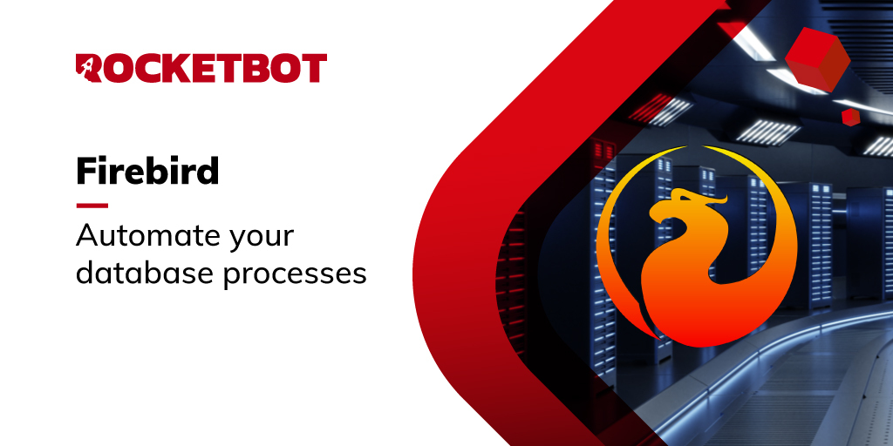

# FireBird
  
Connect to a Firebird database; create tables; insert or update data; make custom queries.  

  
*Read this in other languages: [English](Manual_FireBird.md), [Português](Manual_FireBird.pr.md), [Español](Manual_FireBird.es.md)*  

  

## How to install this module
  
To install the module in Rocketbot Studio, it can be done in two ways:
1. Manual: __Download__ the .zip file and unzip it in the modules folder. The folder name must be the same as the module and inside it must have the following files and folders: \__init__.py, package.json, docs, example and libs. If you have the application open, refresh your browser to be able to use the new module.
2. Automatic: When entering Rocketbot Studio on the right margin you will find the **Addons** section, select **Install Mods**, search for the desired module and press install.  

## Description of the commands

### Connect
  
Connect to a Firebird database.
|Parameters|Description|example|
| --- | --- | --- |
|DSN (Data Source Name)||[host[/port]]:database|
|Username||ISC_USER|
|Password||Valor Predeterminado ISC_PASSWORD|
|Session||Conn1|
|Assign result to variable|Assign connection result to variable.|result|

### Query
  
Execute a custom query.
|Parameters|Description|example|
| --- | --- | --- |
|Query||SELECT <column>, <column> FROM <table> WHERE <column> = <value> ...|
|Session||Conn1|
|Assign result to variable|Assign connection result to variable.|result|

### Update
  
Make changes to a database table.
|Parameters|Description|example|
| --- | --- | --- |
|Table name||Table|
|New value per header/column||{header_1: value_1, header_2: value_2}|
|Conditionals||{header_3: condition}|
|Session||Conn1|
|Assign result to variable|Assign connection result to variable.|result|

### Insert
  
Insert a record into a table from the database
|Parameters|Description|example|
| --- | --- | --- |
|Table name||Table|
|Table headers||Nombre,Dirección|
|Values to insert||1, 'Will'|
|Session||Conn1|
|Assign result to variable|Assign connection result to variable.|result|

### Create Table
  
Create a table within the database.
|Parameters|Description|example|
| --- | --- | --- |
|Table name||Table|
|Column & Data Type||Name varchar(20),EmployeeNumber int|
|Session||Conn1|
|Assign result to variable|Assign connection result to variable.|result|

### Delete Table
  
Delete an existing table in the database..
|Parameters|Description|example|
| --- | --- | --- |
|Table name||Table|
|Session||Conn1|
|Assign result to variable|Assign connection result to variable.|result|

### Select Table
  
Retrieve a whole table data from the database.
|Parameters|Description|example|
| --- | --- | --- |
|Table name||Table|
|Session||Conn1|
|Assign result to variable|Assign connection result to variable.|result|

### Close connection
  
Close the connection to the database.
|Parameters|Description|example|
| --- | --- | --- |
|Session||Conn1|
